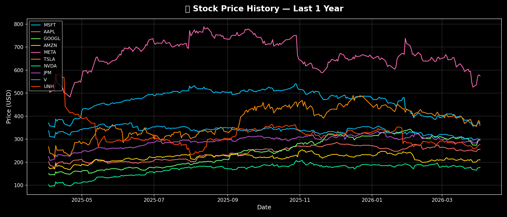
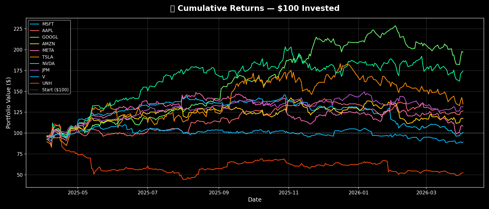
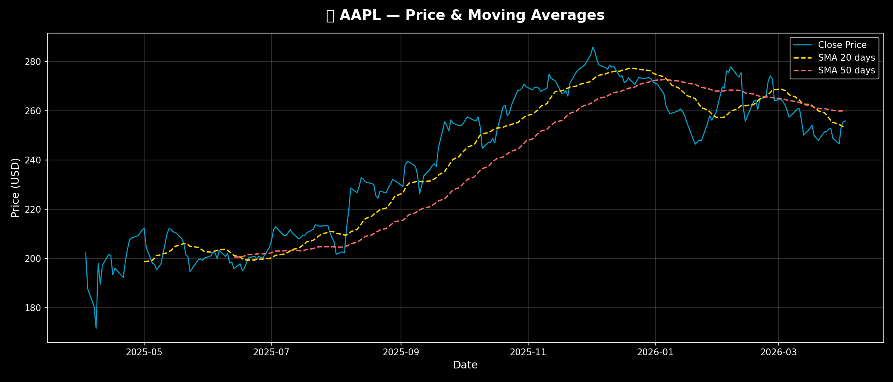
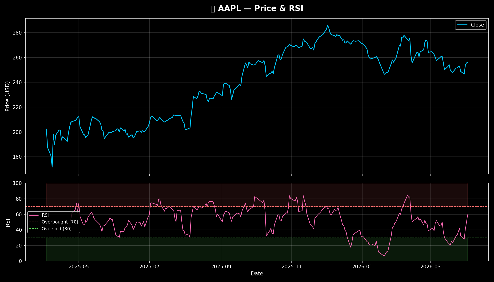
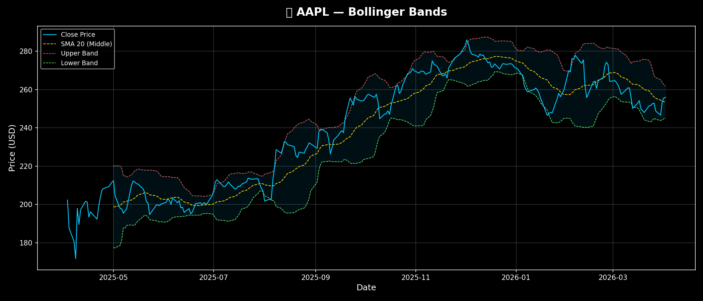
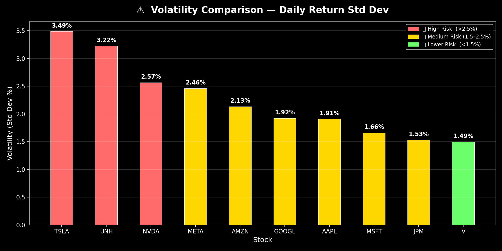
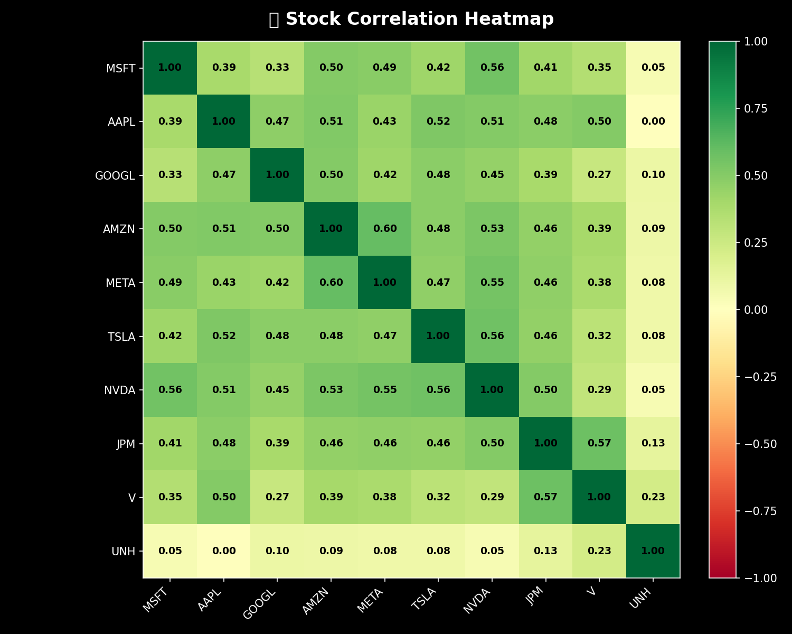

# 📈 Stock Market Performance Analyser

A full-stack data analysis web app built with **Python, Pandas, NumPy, MatPLotLib, Plotly and Streamlit** that downloads, analyses and visualises real stock market data through an interactive dashboard.

[![Streamlit App] **[Click here to view the Live Dashboard](https://poojachalla-stock-market-performance-analyzer.streamlit.app/)**

> No installation needed — opens directly in your browser!

---

## 🌟 Features

### 📊 Data Analysis
- Downloads **1 year of real stock data** for 10 major stocks
- Calculates **daily & cumulative returns**
- Measures **risk** using standard deviation
- Detects **missing data** automatically

### 📐 Technical Indicators
- **SMA** — Simple Moving Average (20 & 50 day)
- **EMA** — Exponential Moving Average (20 & 50 day)
- **RSI** — Relative Strength Index (overbought/oversold signals)
- **Bollinger Bands** — volatility bands around price

### 📉 Interactive Dashboard
- 🔴 Live **KPI metrics** — price, return, volatility, RSI
- 📈 **Price history** chart — all stocks compared
- 💰 **Cumulative returns** — how $100 grows over the year
- 📊 **Moving averages** — trend analysis per stock
- 📉 **RSI chart** — overbought & oversold zones
- 📉 **Bollinger Bands** — volatility visualisation
- ⚠️ **Volatility comparison** — risk across all stocks
- 🔗 **Correlation heatmap** — how stocks move together
- 📋 **Raw data table** — highlighted min/max values

---

## 🛠️ Tech Stack

| Tool | Purpose |
|---|---|
| **Python** | Core programming language |
| **Pandas** | Data manipulation & analysis |
| **NumPy** | Numerical calculations |
| **yfinance** | Real stock market data |
| **Plotly** | Interactive charts |
| **Streamlit** | Web dashboard framework |
| **Matplotlib** | Static chart generation |

---

## 🚀 How to Run
```bash
# 1. Clone the repo
git clone https://github.com/yourusername/Stock-Market-Performance-Analyzer.git
cd Stock-Market-Performance-Analyzer

# 2. Create virtual environment
python -m venv venv

# 3. Activate virtual environment
venv\Scripts\activate        # Windows
source venv/bin/activate     # Mac/Linux

# 4. Install dependencies
pip install -r requirements.txt

# 5. Run the dashboard
streamlit run dashboard.py
```

Then open your browser at `http://localhost:8501` 🎉

---

## 📁 Project Structure
```
Stock-Market-Performance-Analyzer/
│
├── src/
│   ├── stocks_data.py     # Download & explore stock data
│   ├── returns.py         # Return & risk calculations
│   ├── indicators.py      # Technical indicators (SMA, RSI, BB)
│   ├── charts.py          # Static Matplotlib charts
│   └── main.py            # CLI entry point
│
├── plots/                 # Static charts saved here
│   ├── 01_price_history.png
│   ├── 02_cumulative_returns.png
│   ├── 03_moving_averages_AAPL.png
│   ├── 04_rsi_AAPL.png
│   ├── 05_bollinger_AAPL.png
│   ├── 06_volatility.png
│   └── 07_correlation.png
│
├── dashboard.py           # Streamlit interactive dashboard
├── requirements.txt       # All dependencies
└── README.md
```

---

## 📊 Stocks Analysed

| Ticker | Company | Sector |
|---|---|---|
| **MSFT** | Microsoft | Technology |
| **AAPL** | Apple | Technology |
| **GOOGL** | Alphabet (Google) | Technology |
| **AMZN** | Amazon | E-Commerce |
| **META** | Meta (Facebook) | Social Media |
| **TSLA** | Tesla | Automotive/EV |
| **NVDA** | NVIDIA | Semiconductors |
| **JPM** | JP Morgan Chase | Finance |
| **V** | Visa | Finance |
| **UNH** | UnitedHealth | Healthcare |

---

## 📸 Dashboard Preview

### 📈 Price History


### 💰 Cumulative Returns


### 📊 Moving Averages


### 📉 RSI


### 📉 Bollinger Bands


### ⚠️ Volatility Comparison


### 🔗 Correlation Heatmap


---

## 💡 What I Learned

- How to download and clean **real financial data** with Pandas
- How to calculate **stock returns and risk metrics**
- How to build **technical indicators** from scratch using NumPy
- How to create **interactive charts** with Plotly
- How to build a **full web dashboard** with Streamlit
- How to structure a **professional Python project**

---

## 🗺️ Future Improvements

- [ ] Add **MACD indicator**
- [ ] Add **stock price prediction** using Machine Learning
- [ ] Add **portfolio optimisation** (Sharpe Ratio)
- [ ] Deploy to **Streamlit Cloud** (live public URL)
- [ ] Add **date range selector** in dashboard
- [ ] Support **Indian stocks** (NSE/BSE)

---

## 👤 Author

**Pooja Challa**
- GitHub: [@poojachalla-dev](https://github.com/poojachalla-dev)
- LinkedIn: [PoojaChalla](https://www.linkedin.com/in/poojachalla)
